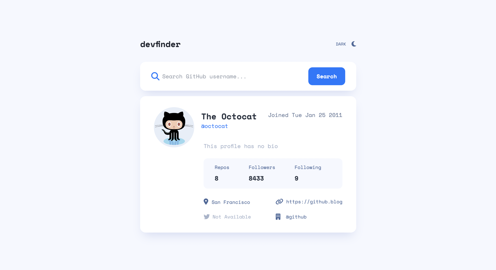

# devfinder
This app uses the GitHub users API to search for users by their username and displays relevant profile information.

## Demo
[Live Demo](https://nc-devfinder.netlify.app/)

## Built with
- HTML
- TailwindCSS
- JavaScript
- Vite

## Features
- [x] Search for GitHub users by their username
- [x] See relevant user information based on their search
- [x] Switch between light and dark themes

## Running this Project Locally
From the repo:
1. Clone this project locally
2. Open the project in your preferred code editor
3. Open your terminal and `cd` to the project directory
4. Run `npm install` to install all relevant dependencies
5. Run `npm run dev` to start a dev server and view the project in your browser

## DevDependencies:
- TailwindCSS
- Vite
